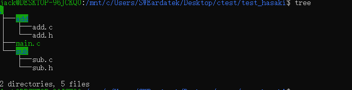
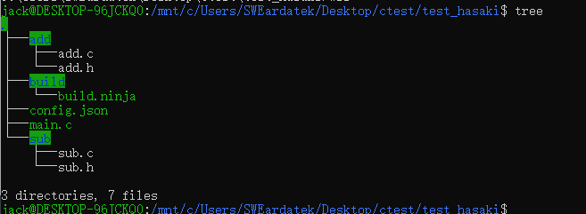
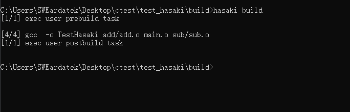
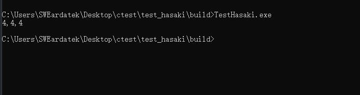

##### 介绍

Hasaki 是一个通用的C/C++的构建工具，它的理念是 ``保持简单  `` ，它用 ``ninja `` 作为后端，仅需要在json文件中编写你的项目信息就可以生成对应的ninja规则文件。


##### 依赖

* python 3.5 +
* [ninja](https://ninja-build.org/) （ninja是google开发的一个通用构建工具）


##### 特点

* 简单
* 构建速度快（得益于ninja)


##### 使用方法

在 [这里](https://github.com/JackLin00/hasaki/releases/tag/v0.1) 下载 `` windows `` 的可执行文件，并将其放置到你的环境变量目录之中。然后开始下面的旅程。

hasaki 现支持以下子命令：

* init :该子命令用于创建一个config.json文件，通过编写该文件的内容就可以让hasaki生成对应的build.ninja文件
* gen:该子命令用于根据输入的配置json文件（当不输入的时候默认为当前目录下的config.json文件）生成对应的build.ninja文件
* build:该子命令会根据执行目录的build.ninja文件来构建工程
* clean:和make clean命令一样


说的太多不如来个实例：

我们以一个加减法项目为例子，该项目的文件夹有以下文件：



其中，main.c的内容如下：

```c
#include "add.h"
#include "sub.h"
#include <stdio.h>


int main(){
	printf("%d,%d,%d\r\n",add(3,1),sub(5,1),EXTERNAL_VAR);
	return 0;
}
```

add.c的内容如下：

```c
#include "add.h"

int add(int a,int b){
	return a+b;
}
```

sub.c的内容如下：

```c
#include "sub.h"

int sub(int a,int b){
	return a-b;
}
```

其中，头文件add.h和sub.h分别为各自源文件的函数声明。

现在，我们来开始使用 hasaki来构建该项目：

1. 用hasaki初始化一个配置文件，执行以下命令：

   ```
   hasaki init
   ```

   执行之后，会生成config.json文件，内容如下：

   ```json
   
   {
       "global_cflag": [  
           "add global cflag in there"    # 全局的cflag
       ],
       "link_flag": [
           "add link flag in there"       # 程序链接时的参数
       ],
       "action": [{
           "name": "action name",         # 项目名称
           "type": "exe",                 # 项目类型，现仅支持 exe
           "cc": "gcc",                   # 编译器cc
           "ar": "ar",                    # 编译器ar
           "ld": "ld",                    # 连接器ld
           "src_file_filter_suffix": [    # 用于识别源文件的后缀
               ".c", ".C", ".s", ".S"
           ],
           "src_path": [                  # 项目源文件的路径
               "./add"
           ],
           "src_args": [                  # 项目源文件的 cflag
               "add src sub-cflag in there"
           ],
           "inc_path": [                  # 需要包含的头文件路径
               "input inc path"
           ],
           "obj_file_suffix": ".o",       # 中间文件的后缀
           "output_dir": "build",         # 编译文件的输出路径
           "use_ld_flag": "False"         # 是否使用ld来连接程序,当你不知道什么意思的时候，不要选择True
       }],
       "prebuild_action": [               # 在编译前执行的动作
           ""
       ],
       "postbuild_action": [              # 编译后执行的动作
           ""
       ]
   }
   ```

   

2. 填写项目信息，内容如下

   ```json
   
   {
       "global_cflag": [
           ""
       ],
       "link_flag": [
           ""
       ],
       "action": [{
           "name": "TestHasaki",
           "type": "exe",
           "cc": "gcc",
           "ar": "ar",
           "ld": "ld",
           "src_file_filter_suffix": [
               ".c", ".C", ".s", ".S"
           ],
           "src_path": [
               "./add",
               "./sub",
               "."
           ],
           "src_args": [
               "-DEXTERNAL_VAR=4"
           ],
           "inc_path": [
               "./add",
               "./sub"
           ],
           "obj_file_suffix": ".o",
           "output_dir": "build",
           "use_ld_flag": "False"
       }],
       "prebuild_action": [
           ""
       ],
       "postbuild_action": [
           ""
       ]
   }
   ```

3. 生成对应的build.ninja

   执行命令:``hasaki gen `` ，这个根据你填入的输出目录(这里的位置为build)来生成对应位置的build.ninja。执行效果如下：

   

   可以看到，在目录build已经存在一个名为build.ninja的文件

4. 编译项目源文件

   进入到目录build,执行命令 ``hasaki build `` ，生成项目,效果如下：

   

   大功告成，执行一下TestHasaki，得到的效果如下：

   

   无误，结束。


##### 建议或者意见

如果大家有什么建议和意见，请提交issue，或者直接和我联系。